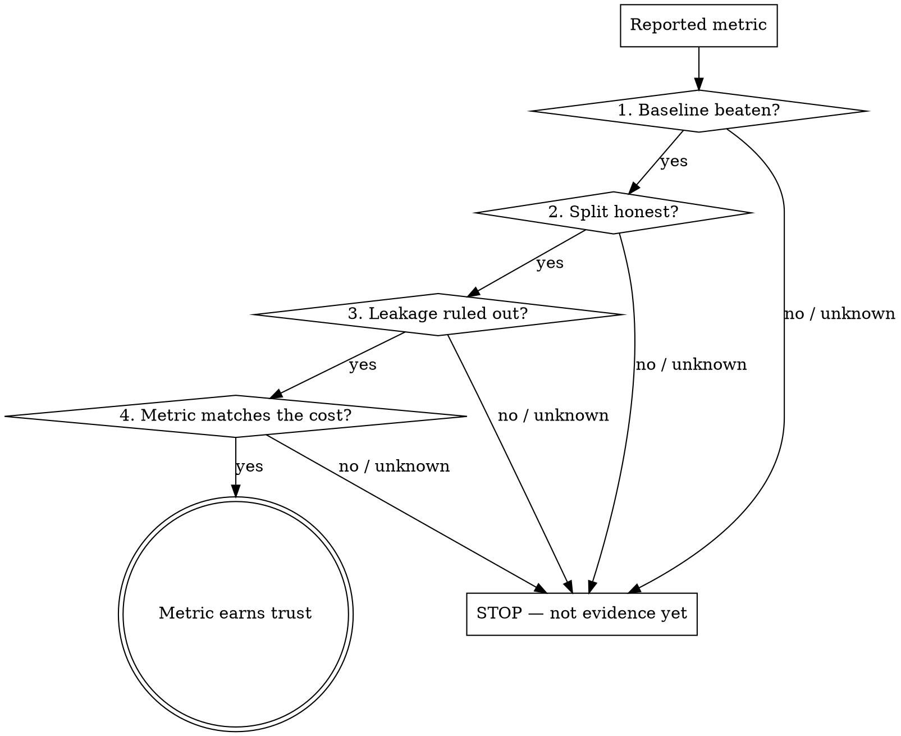

# ML Result Skepticism

A surprisingly good number is a bug report until proven otherwise.

Most "great results" in ML are not great models — they are leaks, broken splits, or comparisons against nothing. The validation accuracy that jumped to 0.98 overnight almost never means the model got smart. It means information moved from where it shouldn't be, or the number is measuring the wrong thing.

This skill is the spine of the `mlcheck` pack. It does not analyze data itself — it **forces the four checks** that have to pass before any reported metric earns trust.

## The Iron Law

**NO METRIC IS TRUSTED UNTIL LEAKAGE IS RULED OUT, THE SPLIT IS AUDITED, AND A BASELINE IS BEATEN.**

A number without these three is not evidence. It is a claim. You may not report it, compare against it, tune on it, or make a decision from it until the gate below passes.

## When This Triggers

Run the gate whenever you are about to:

- Report or screenshot a metric (accuracy, AUC, F1, RMSE, …).
- Say "the model works" / "we beat the baseline" / "this is good enough to ship."
- Pick between two models based on their scores.
- Feel pleased or surprised by how high a number is. **Surprise is the loudest trigger.**

If a result feels too good, it is. Run the gate.

## The Gate

You MUST pass these in order. Each links to the skill that does the actual work — invoke it, do not eyeball it.



1. **Baseline beaten** — invoke `establishing-baselines`. A number means nothing without a dumb baseline it must beat. If you don't know what `DummyClassifier`/the majority class/the persistence forecast scores, you don't know if your model did anything.
2. **Split honest** — invoke `designing-validation-splits`. Confirm the split mirrors production: time-ordered if you predict the future, grouped if rows share an entity, stratified if the target is imbalanced.
3. **Leakage ruled out** — invoke `detecting-data-leakage`. Confirm every transform was fit on train only and no feature encodes the answer.
4. **Metric matches the cost** — invoke `choosing-evaluation-metrics`. Confirm the metric reflects the real cost of being wrong (accuracy on a 99/1 split is a lie).

**Order matters.** A leakage check on a broken split tells you nothing. Baseline first (cheapest, catches "the model learned nothing"), then split, then leakage, then metric.

### Run the whole gate at once

`mlcheck` can run every applicable check and emit one consolidated report (with fixes and a CI exit code):

```bash
mlcheck audit --source train.py --train train.csv --test test.csv \
    --target label --time-col ts --group-col user_id \
    --task classification --metric accuracy --model-score 0.97 --fail-on error
```

It runs only the checks it has inputs for, so you can start with just `--source` and add data as you go. A non-zero exit means the result has not earned trust — wire it into CI to stop a leak from ever reaching `main`.

## Reading the Result

- **"Too good to be true" magnitude.** Near-perfect AUC on a hard problem, RMSE near zero, accuracy that jumped after a refactor → assume a leak until proven otherwise.
- **Validation ≫ what's plausible.** If a domain expert would be shocked, be shocked.
- **The gap to baseline is the real result.** Report "model 0.91 vs majority-class 0.88" — a 3-point lift — not "0.91". The headline number without its baseline is marketing.

## Anti-Rationalization

| The thought | The reality |
|---|---|
| "The score is high, we're done." | High scores are the symptom of leakage, not proof of skill. The gate exists *because* the number looks good. |
| "I'll check for leakage later if it matters." | You will report the number first and it will become 'fact'. Check before it leaves your screen. |
| "It's a standard `train_test_split`, it's fine." | Standard splits silently leak on time-series and grouped data. 'Standard' is not 'honest'. Audit it. |
| "I don't need a baseline, the number is obviously good." | 'Obviously good' against nothing is meaningless. On a 95/5 split, 95% accuracy is the *baseline*, not a result. |
| "Accuracy is 0.97, that's a great metric." | Accuracy hides the only errors you care about under imbalance. Match the metric to the cost first. |
| "This is just an experiment, not production." | Experiments set the direction of weeks of work. A leaked experiment sends the whole project the wrong way. |

> **From the trenches (a medical risk-scoring model):** A risk classifier hit an AUC that looked like a breakthrough. The gate caught it at step 3: a clinical feature was recorded *after* the outcome it was predicting — the model was reading the answer key. Without the skepticism gate, that "breakthrough" would have gone into a slide. With it, the real, lower, honest number drove the next month of work.

## Verification Checklist

Before you let a metric out of your hands:

- [ ] You know the baseline score and your model beats it by a margin you can defend.
- [ ] You audited the split (ran `designing-validation-splits`) and it mirrors production.
- [ ] You ran the leakage scan (`detecting-data-leakage`) and it is clean.
- [ ] You confirmed the metric matches the cost of error (`choosing-evaluation-metrics`).
- [ ] You report the **lift over baseline**, not the raw number alone.

If any box is unchecked, the number is a claim, not a result. Say so out loud.

## After the Gate

Once all four pass, the metric is trustworthy — report it *with its baseline and its split design*. If the result got worse after the gate (it usually does), that is the gate working: you just avoided shipping a lie.
